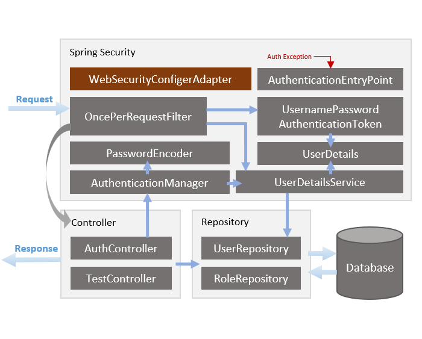
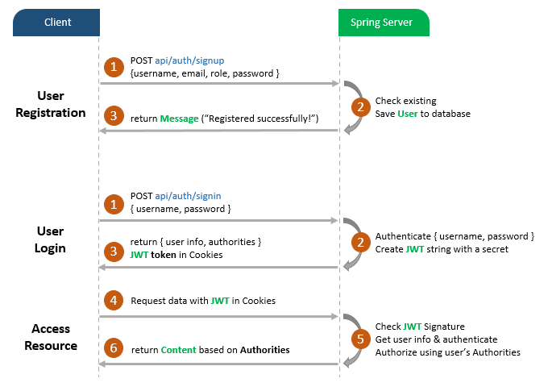

# Architecture



## Project Structure

The architecture of the project is based on the following components:

```bash
├── .mvn                 - Maven wrapper
├── docs                 - Documentation files
├── muse                 - Main application structure
├── target               - Target directory for compiled code
├── .gitignore           - Git ignore file
├── docker-compose.yml   - Docker configuration
├── Dockerfile           - Docker configuration
├── pom.xml              - Maven dependencies
├── README.md            - Readme file
```

### Source Directory

The `src` directory contains the source code for the Admin Dashboard project. It includes the following components:

```bash
├── src                    - Source code
  ├── main                 - Main application structure
    ├── java               - Java source code
      ├── com.muse.spring.login
        ├── controllers          - Contains controller classes that handle HTTP requests and map them to service calls.
        ├── models               - Contains the data models used within the application, such as request and response models.
        ├── payload              - Contains payload classes that represent the request and response payloads for API endpoints.
        ├── repository           - Includes repository interfaces for data access, typically extending Spring Data JPA repositories.
        ├── security             - Houses security-related classes, such as configuration for authentication and authorization.
        ├── MuseApplication.java - The main application class that serves as the entry point for the Spring Boot application.
    ├── resources           - Resource files
      ├── application.properties - Application properties
```

### Flow


