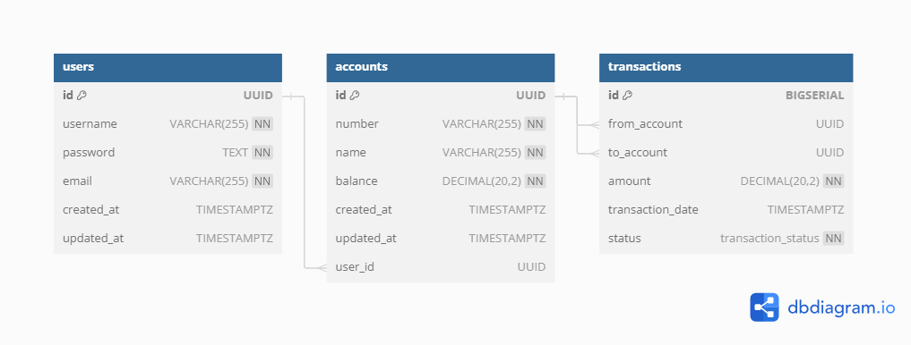

# Database

- **User Model** (Users can have more than one account.)
  Fields:
  - id (UUID): A unique identifier for the user.
  - username (String): The user's chosen username.
  - password (String): The user's encrypted password.
  - email (String): The user's email address.
  - createdAt (LocalDateTime): The user’s create date.
  - updatedAt (LocalDateTime): The user’s update date.
- **Account Model** (Accounts belong to only one User.)
  Fields:
  - id (UUID): A unique identifier for the account.
  - number (String): A unique account number.
  - name(String): A unique account name.
  - balance (BigDecimal): The current balance of the account.
  - createdAt (LocalDateTime): The account’s create date.
  - updatedAt (LocalDateTime): The account’s update date.
- **Transaction Model**
  Fields:
  - id (Long): A unique identifier for the transaction.
  - from (Account): The account ID from which money is being transferred.
  - to (Account): The account ID to which money is being transferred.
  - amount (BigDecimal): The amount of money being transferred.
  - transactionDate (LocalDateTime): The date and time when the transaction was initiated.
  - status (Enum): The status of the transaction (e.g., "SUCCESS", "FAILED").

